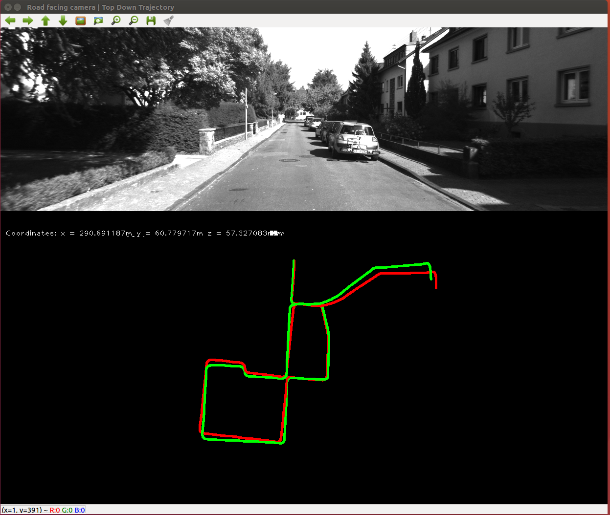
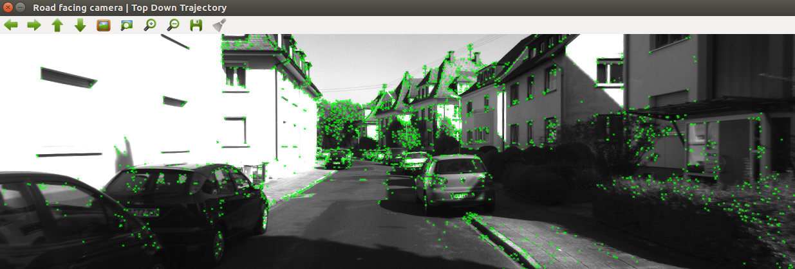

# Monocular visual Odometry C++

<p align="center">
  
</p>


This is a simple implementation that mostly uses OpenCV. However, I plan to replace major components
with different ideas, like using Deep Learning for features etc. Stay tuned and feel free to ask
me with any questions that you might have.


## Current algo is as follows

```
    1. Capture images: It, It+1,
    2. Undistort the above images. (using kitti so this step is done for you!)
    3. Use FAST algorithm to detect features in It, and track those features to It+1. A new detection is triggered if the number of features drop below a certain threshold.
    4. Use Nister’s 5-point alogirthm with RANSAC to compute the essential matrix.
    5. Estimate R,t from the essential matrix that was computed in the previous step.
    6. Take scale information from some external source (like a speedometer), and concatenate the translation vectors, and rotation matrices.

```


## Deps

1. OpenCV 3
2. cmake 3.1 or greater

## Dataset (Kitti Odometry: http://www.cvlibs.net/datasets/kitti/eval_odometry.php)

1. Grab the grayscale
2. ground truth poses


## Building and Running
1. clone this repo
2. `mkdir build && cd build`
3. `cmake ..`
4. `make`
5. ./mono_vo

## FAST features Visualized

To see the FAST features visualized
1. `./mono_vo viz`

<p align="center">
  
</p>


## TODOs

1. fix to work with any given sequence in the kitti dataset.
2. figure out a better way to estimate scale (perhaps use lidar!)
3. better document the code
4. DRY the code up.

## Credit
Major S/O to a blog http://avisingh599.github.io/vision/monocular-vo/ that gave the inspiration and a good starting point. Go read his blog to get a better understanding of the basics. :)